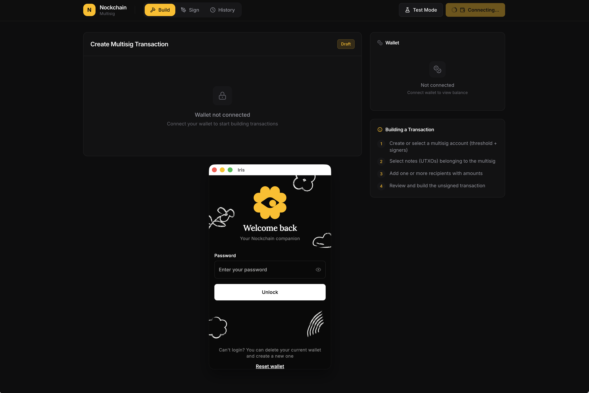
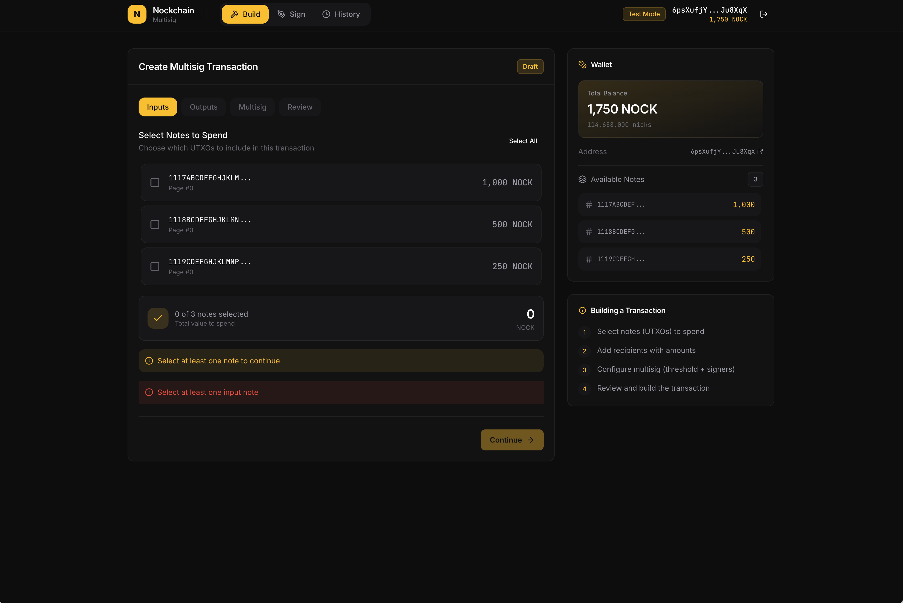

# Nockchain Multisig

Multisig transaction builder for Nockchain.





## How It Works

### Nockchain Multisig Concepts

In Nockchain:
- **Notes** are UTXOs (unspent transaction outputs)
- Each Note's spendability is governed by its **Lock**
- A Note is identified by `[first_name, last_name]` where `first_name` = hash of the Lock
- **%pkh** lock primitive governs how many signatures are needed to spend

For a multisig lock (e.g., 2-of-3):
- The Lock is defined by threshold + signer PKHs
- All Notes belonging to this multisig share the same `first_name` (lock hash)
- Any signer can query notes for the multisig using this lock hash

## Usage Flow

### 1. Connect Wallet
- Click "Connect Wallet" to connect Iris Wallet extension
- Or use "Test Mode" for development/testing

### 2. Build Transaction
- **Inputs**: Select notes (UTXOs) to spend
- **Outputs**: Add recipient addresses and amounts
- **Multisig**: Configure threshold and signer PKHs
- **Review**: Verify transaction details
- Click "Build & Sign" to create the transaction

### 3. Sign Transaction
- The transaction appears in the "Sign" tab
- If you're a configured signer, click "Sign" to add your signature
- **Export** the transaction to share with co-signers
- Co-signers import and add their signatures

### 4. Broadcast
- Once threshold signatures are collected, the "Broadcast" button enables
- Click to submit the transaction to the network

## Test Mode

Test mode allows development without the Iris Wallet extension:
- Creates mock notes for testing
- Signatures are simulated (random bytes)
- Broadcasts are simulated

## Tech Stack

- React 19 + TypeScript
- Vite
- Zustand (state management)
- Tailwind CSS
- @nockbox/iris-sdk (wallet integration)
- @nockbox/iris-wasm (Nockchain transaction logic)

## Requirements

- Node.js 18+
- Iris Wallet browser extension (for production use)

## To run 

```bash
npm run dev
```

Open http://localhost:5173
